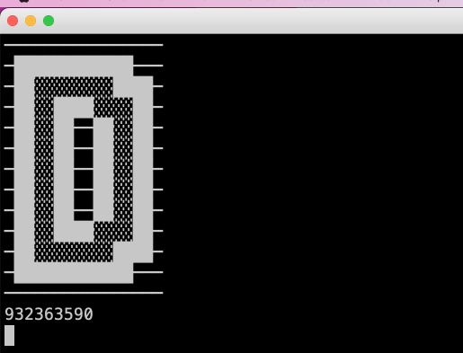

# rough-clock
Shows the approximate time.

When you wake up early in the morning, often you want  rough idea of the time, not the exact time, lest you worry about it ad can't fall asleep again.

This script displays the time as follows:

A - 0:00-3:00
B - 3:00-6:00
C - 6:00-9:00
D - 9:00-12:00
E - 12:00-15:00
F - 15:00-18:00
G - 18:00-21:00
H - 21:00-0:00

